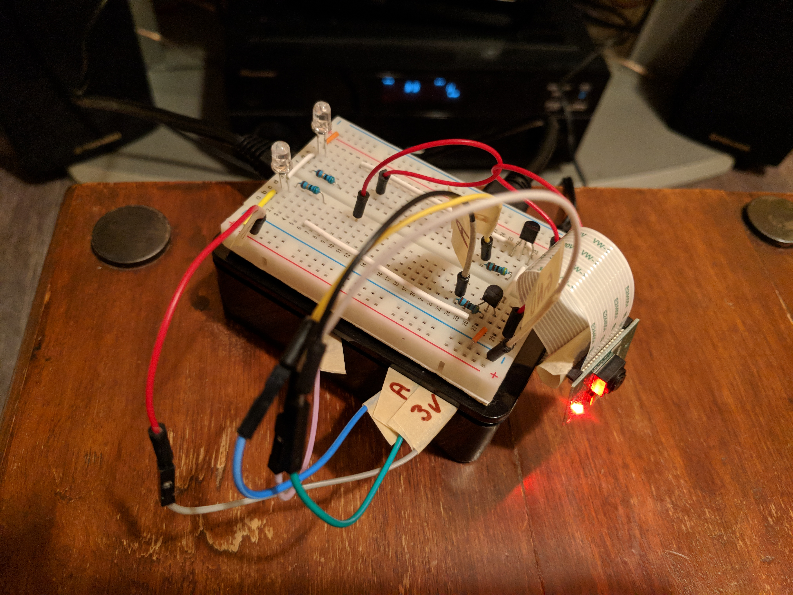
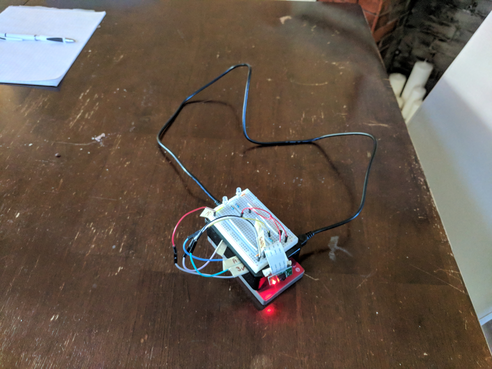
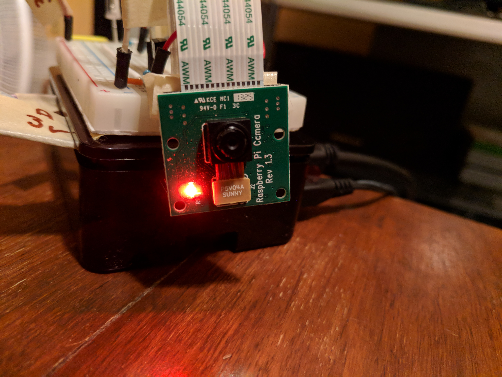

# PiTracker - Object tracking with the Raspberry Pi

 
  
  
  

A simple computer vision application for object tracking with the raspberry pi. Click the image below to see a video demo.

 
  

This was a small hobby project to track an object with the raspberry pi camera. Information is  available in [the doc section](doc/intro.md). 
