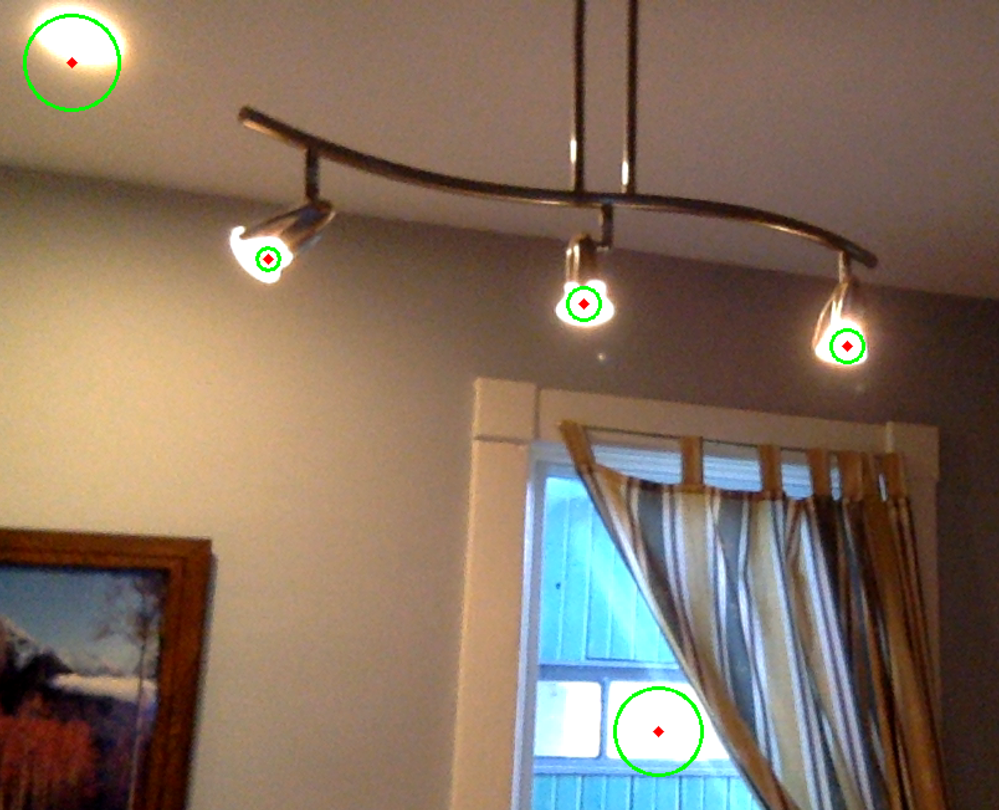

# PiTracker - Computer Vision
The computer vision aspect of this code is very simple. I chose the flashlight on
a camera as the object to track for two reasons. First, everyone will have one on them
unlike a tennis ball or picture of a duck. Second, the light should be the brightest
object in the image making it easy to track.

Without putting in too many hours, I wanted a simple demo that worked in the following situations:
  - Change in lighting
  - Change in object (using a different phone)
  - Change in camera location (mounted on the device)
  
## Overview of the program
The program has two basic steps:
  1) Find bright objects that look like a circle
  2) Filter all circles to find the most likely circle

The pseudo code looks like this:
```pseudo
  1) While true
      a) Grab current frame
      b) Process frame
          i) Threshold to find bright object
          ii) Find all objects that look like circles
      d) Filter objects
          i) Find the object closest to the previous object
```

## Process frame
The processing is a little trickier than I would lead you to beleive. I found
the pi camera to be very noisy introducing many small objects if I did not blur the data.
Additionally, there are often shadows in the background. So I wanted an image processing pipeline
that would deal with this.

In full disclosure, I read ~5 projects on tennis ball tracking using the Hough
transform before I started playing with my pipeline. I wish I had kept a reference to them
but they're all going to be on the first page of a google search.

### CLAHE
First I did some adaptive histogram equalization and blurring. [CLAHE](https://en.wikipedia.org/wiki/Adaptive_histogram_equalization)
has the advantage of correcting shadow effects but also of enhancing the contrast between
bright object in an image. Really, CLAHE made the camera light slightly brighter than any
background light. I applied CLAHE independantly to each component of the image. Following,
I did a very large Gaussian blur to the whole image to smooth out camera noise.
 ```python
 # Do some adaptive histogram equalization to deal with uneven lighting
split = cv2.split(frame)
clahe = cv2.createCLAHE(clipLimit=2.0, tileGridSize=(10,10))
for i in range(len(split)):
    split[i] = clahe.apply(split[i])
eq = cv2.merge(split)

# Do some blurring. This smooths out the final segmentation
blur = cv2.GaussianBlur(eq, (21, 21), 0)
```

### Threshold
Next, we transform the image to the HSV color scale and do some thresholding for
bright object. Our camera light often clips the dynamic range of our camera, so
this is perfect! Invariant to all lighting conditions, even the dark!
```python
hsv = cv2.cvtColor(blur, cv2.COLOR_BGR2HSV)
thresh = cv2.inRange(hsv,
    np.array([0.00*256, 0.00*256, 0.95*256]),
    np.array([0.05*256, 0.05*256, 1.00*256]))
 ```

### Hough Circle Transform
Next, we find all binary object that look like circles using the [Hough circle
transform](https://en.wikipedia.org/wiki/Hough_transform). This returns a list of list. Each row in that matrix has an x corrdinate
and y corrdinate for the center and a radius.
```python
circles = cv2.HoughCircles(thresh, cv2.HOUGH_GRADIENT,
                1, np.sqrt(thresh.size)/8,
                param1=10, param2=10,
                minRadius=5, maxRadius=int(np.sqrt(thresh.size)/4)
                )
```

### Visualization Results
One can visualize the circles fairly easy in OpenCV.
```python
# Process image
circles = FindCircles(frame)

if circles is not None:
    print("Found {} circles".format(len(circles)))
    circles = np.uint16(np.around(circles))
    for i in circles[0,:]:
        # draw the outer circle
        cv2.circle(frame,(i[0],i[1]), i[2], (0,255,0), 2)
        # draw the center of the circle
        cv2.circle(frame,(i[0],i[1]), 2, (0,0,255), 3)
else:
    print("Found zero circles")

# Show frame
cv2.imshow('Frame', frame)
if cv2.waitKey(1) & 0xFF == ord('q'):
    break
```

The output of all this processing can be seen below.
<p align="center"> 


</p>

## Filter objects
As one can see from the images above, if there are multiple lights the image processing
will detect multiple objects. There are a few ways we could get around this limitation.
  - Threshold by size. However, this will become sensitive to distance from camera to object and 
  - Look for bright objects surrounded by dark objects. This could work but not all phone cases are black. Plus, there is lots of blur around the light.
  - Only keep the circle closest to the last circle you took. You could lose the object when it goes infront of another light.
  
I opted for the third option. Easy to implement and the user will intuitively understand the
processing. "If it fails, it locked onto the wrong light. Cover the camera with your hand and
start again".

The implementation is straight forward. We keep an object called `LastCenter` as a member variable
of the function (this is a python-ism). For each circle, calculate the distance between the current
circle center and the last circle center. Take the circle which is the closest.
```python
bestMatch = np.inf
for index in circles[0,:]:
  distance = np.linalg.norm(np.array([i[0],i[1]]) - ProcessCircles.LastCenter)
  if distance < bestMatch:
    bestMatch = distance
    i = index
```
This is a general problem of tracking points in an object. You have three object and they
move. How do you associate the objects in frame `i` with objects in frame `i-1`? This is
a cheap trick since we only need one. 

Ultimitely, we would like to add some smoothing over time. Given more time, I would sort out
the algorithm to track all circles in the image. That is, determine correspondance between
all circles in frame `i` and frame `i-1`. I would store, say, the last 5 points and fit the motion
with a parametric curve like a bspline. Since the camera isn't moving and the background lights aren't moving,
all objects in the field of motion have a high time-averaged velocity. I would get better
localization with the bspline as well as a nice mathematical interpretation of velocity over time.
Now, one could track multiple object! But that's for another day.
