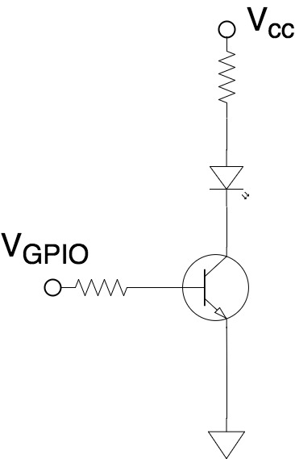
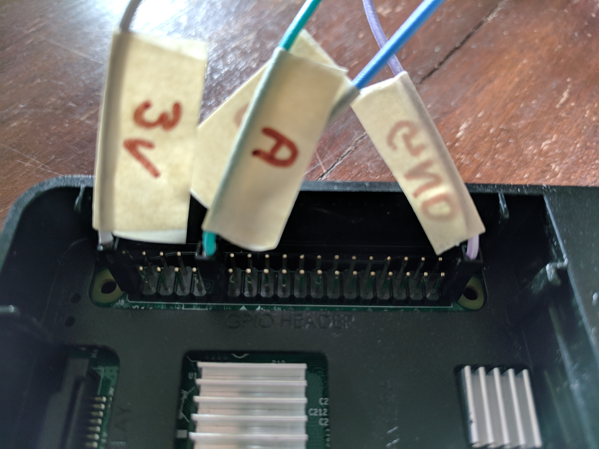
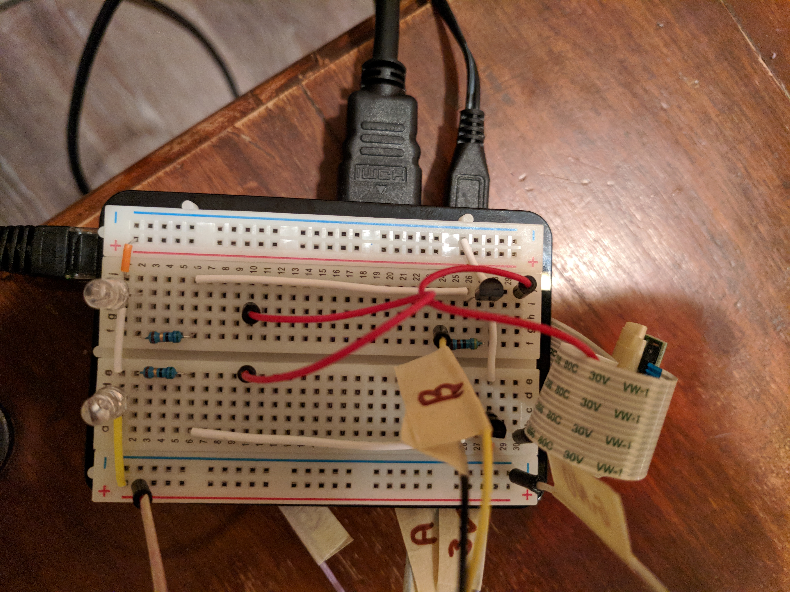

# PiTracking - Hardware
We have two peices of hardware: the camera, the LEDs. I purchased
a [starter kit](https://www.amazon.ca/CanaKit-Raspberry-Complete-Starter-Kit/dp/B01CCF6V3A/ref=sr_1_4?ie=UTF8&qid=1512254645&sr=8-4&keywords=raspberry+pi+3).
I found the black case provided with the starter kit easy to use. The
camera cable and GPIO wires could be thread from the PCB onto a solderless breadboard
through the slit in the top of the case. If a wire disconnected, the black top easily
came off so you could fix the issue.

The hardware shopping list is as such*:
  - 1x [Raspberry Pi Model 3](https://www.amazon.ca/Raspberry-Pi-RASPBERRYPI3-MODB-1GB-Model-Motherboard/dp/B01CD5VC92/)
  - 1x [MicroSD Card](https://www.amazon.ca/SanDisk-microSDHC-Standard-Packaging-SDSQUNC-032G-GN6MA/dp/B010Q57T02/)
  - 1x [MicroSD Card Reader](https://www.amazon.ca/IOGEAR-MicroSD-Reader-Writer-GFR204SD/dp/B0046TJG1U/)
  - 1x [Pi Camera](https://www.amazon.ca/Raspberry-Pi-Camera-Module-Megapixel/dp/B01ER2SKFS)
  - 1x [Power Supply](https://www.amazon.ca/BoxWave-Amazon-Kindle-Paperwhite-Charger/dp/B0007POE6O/)
  - 2x [NPN transistors, such as the 2N4401](https://www.onsemi.com/pub/Collateral/2N4401-D.PDF)
  - 2x [Colored LEDs](https://www.amazon.ca/100Pcs-5Colors-Ultra-Bright-Yellow/dp/B015RRG9S2)
  - 1x [Small breadboard](https://www.amazon.ca/OSEPP-Breadboard-400-Points-Components-LS-00018/dp/B00EFZV2CG)
  - 2x [4K ohm resistors](https://www.amazon.ca/KKmoon-Resistors-Assortment-Electronic-Components/dp/B01N6B5CJ2)
  - 2x [56 ohm resistors](https://www.amazon.ca/KKmoon-Resistors-Assortment-Electronic-Components/dp/B01N6B5CJ2)
  - 1x [Male-Male Jumper Wires](https://www.amazon.ca/Smraza-Multicolored-Breadboard-Raspberry-piS02-CN/dp/B072PSG3TB)
  - 1x [Female-Male Jumper Wires](https://www.amazon.ca/Smraza-Multicolored-Breadboard-Raspberry-piS02-CN/dp/B072PSG3TB)
  - 1x [Masking Tape](https://www.amazon.ca/Scotch-Masking-Stationery-54-8m-3436-C/dp/B00GGBHT8I)
  - 1x [Portable Power Bank](https://www.amazon.ca/10000mAh-Portable-Battery-Charger-Samsung/dp/B01DIBTZ0S)
* All links to random Amazon searches for reference. Numbers are minimums.

## Setup Raspberry Pi
Follow your favorite method for setting up a Raspberry Pi. I like the
[headerless setups](https://caffinc.github.io/2016/12/raspberry-pi-3-headless/).
You can setup WiFi and open the SSH port on the Pi without a keyboard and SSH straight
into the device.

Flash the SD card, power the device on, sign in, run hello world. You're good to go.

## Install the Camera
There are many tutorials online which I won't repeat. I believe I
followed [The Pi Hut](https://thepihut.com/blogs/raspberry-pi-tutorials/16021420-how-to-install-use-the-raspberry-pi-camera)
for how to install the camera.

I used the masking tape to stick the back of the camera to the case.

  
  

## LED Configuration
Using the masking tape, attach the breadboard to the top of the case. The breadboard
has two ground (blue, -) and two Vcc lines (read, +). Wire the pins from the raspberry pi
into the ground and Vcc. The concept here is to turn on the LED when the GPIO pin goes high.

I do not like wiring the GPIO pin directly into the LED. It is reported that the GPIO pins
can support 50 mA, but that seems too high. I would hate to wreck the GPIO pins. Instead,
I will use a transistor to amplify the GPIO current.

An electronics person can do a better design. I am going to be simple and amplify the
base current from the GPIO pin to turn on the LED.

  

I bought cheap LEDs, cheap NPN transistors, and cheap resistors all with no datasheet.
I find numerical values used for design are very variable with cheap parts. I do not
want to blow up my LEDs either. Roughly speaking, keeping the LED current below 20 mA
is probably safe.I would expect beta to be between 100 and 150. Resistors are probably
within 15% of the marked values. I would expect the NPN base-emitter voltage to be
something close to 0.7 V. I found a collector resistor of 56 ohms and a base resistor
of 4 k ohms to work well.

The Pi header wiring and solderless breadboard wiring are showen below.

  
  

I used GPIO17 (Pin# 11, GPIO_GEN0) for LED A and GPIO18 (Pin# 12, GPIO_GEN1) for LED B.

## Current Measurements
Once the board was wired up, I did some current measurements to make sure my math
worked out. I was looking for a very small current from the GPIO pins and a current
through the LED less than 15 mA but still large enough to have a bright LED.

Pin | GPIO Current | Total Current |
----|--------------|--------------|
LED A | 0.54 | 5.95 |
LED B | 0.51 | 5.11 |

When I turned on both LEDs I had a total current from the headers to the board of 11.06 mA.
I'm happy with these current values.

## Battery Supply
Finally, I needed a battery supply. I chose a very high end portable power bank that I can recharge,
run for hours, and provides enough current to run the Raspberry Pi. Although they're expensive,
I hate dealing with batteries. This is a nice solution in my eyes.

## Missing Parts
Currently, to turn off the device you need to unplug the power. Disconnecting power without
powering down the machine can cause the SD card to become corrupt, although I have never experienced
it. I took the risk and just power off the machine by disconnecting the power. However, there
are [methods](https://github.com/TonyLHansen/raspberry-pi-safe-off-switch) to safely power down the
device using a physical switch or button.
