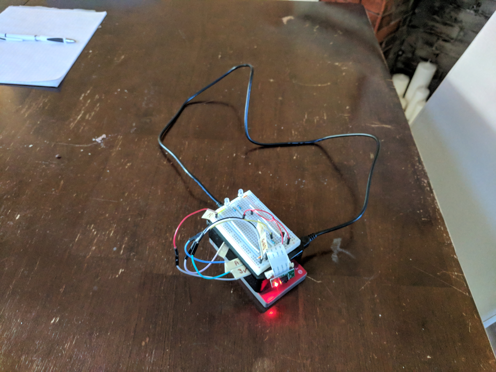
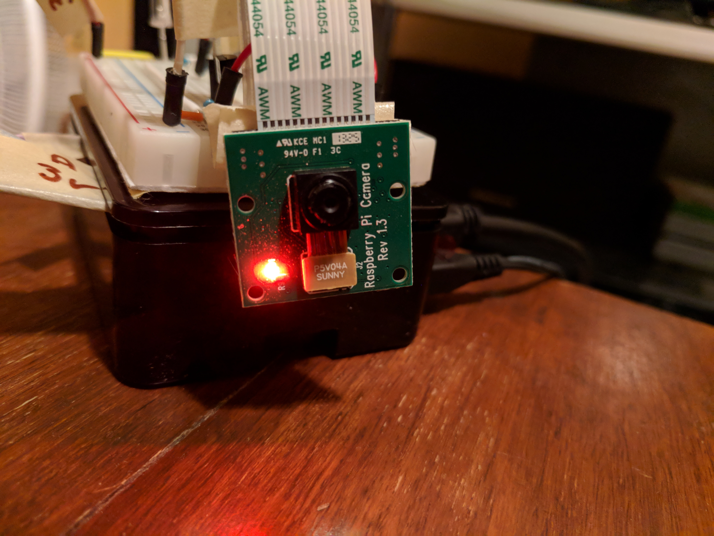

# PiTracking - Object tracking with the Raspberry Pi

 

## Objective
Create a prototype which could track an object and alert
the user if the object was present, on the left, or on the right.
We had full control over the environment so we decided on the following
demonstration:
  - Track the flashlight on your camera
  - Use two LEDs to alert the user
  - Use the raspberry pi camera

We chose to track the flashlight on the phone because it is stable.

## Build Instructions
Build instructions are broken up by topic:
  - [Hardware](hardware.md)
  - [Software](software.md)
  - [Computer Vision](cv.md)

These build instructions are rather loose. You should expect to do some
trouble shooting when building this project. Examples include installing
a missing dependancy through `apt-get` or figuring out how to use an
ameter.
